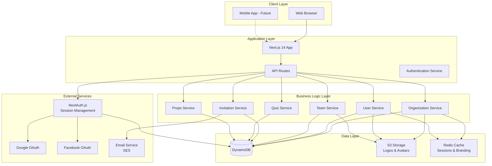
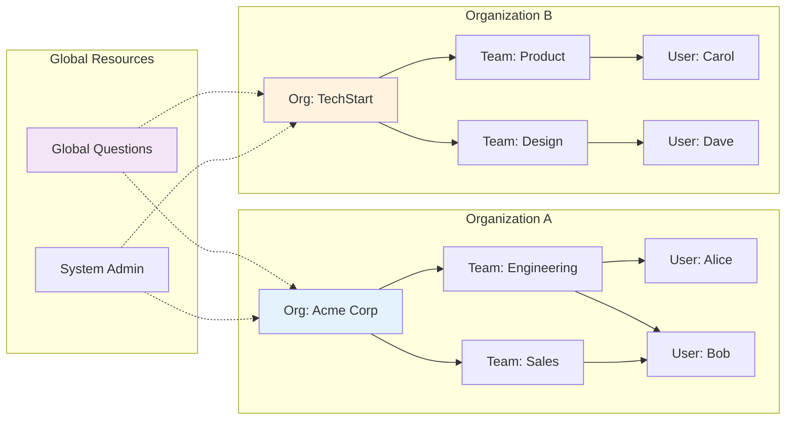
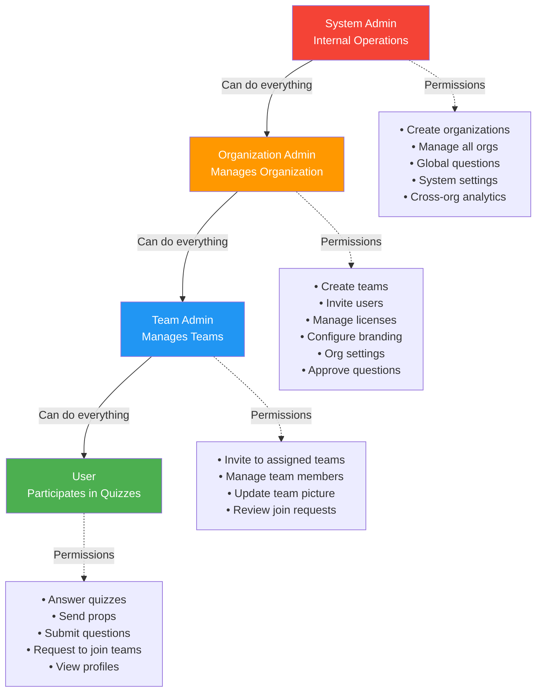
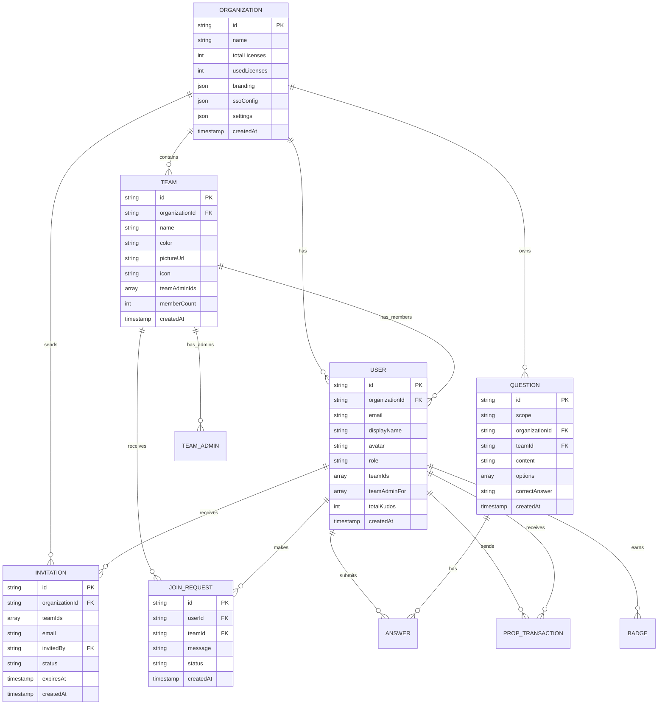
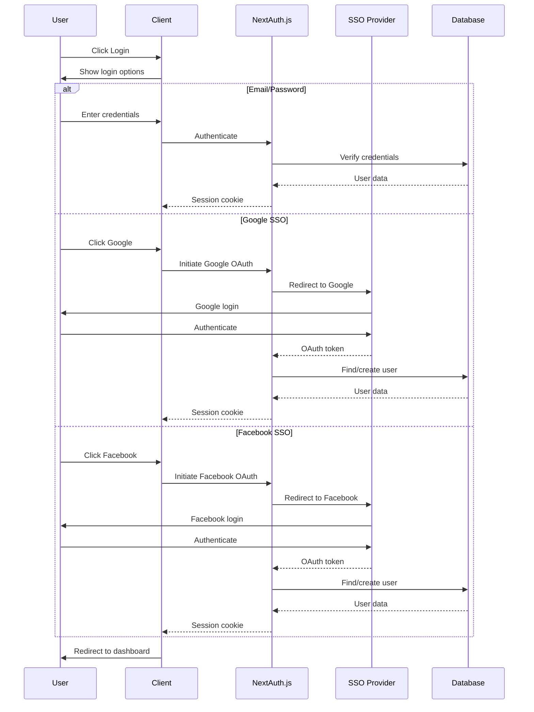
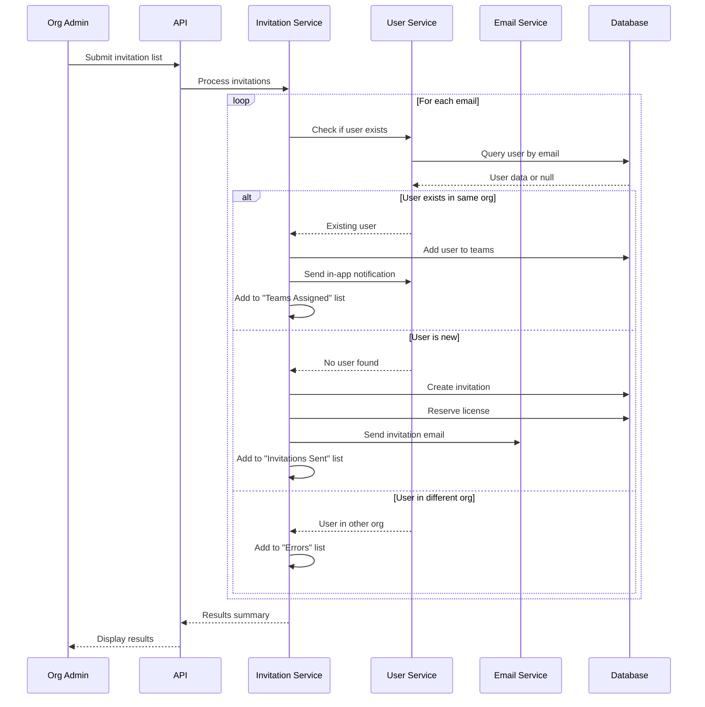
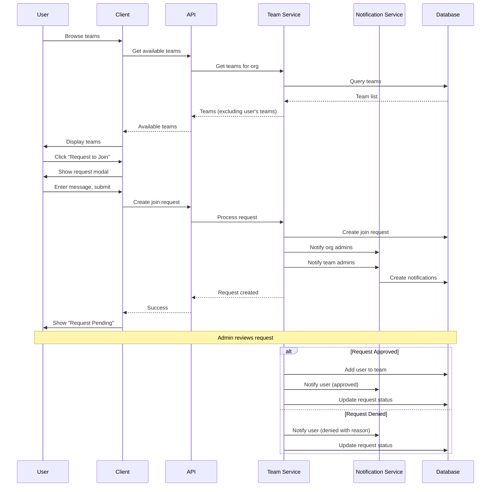
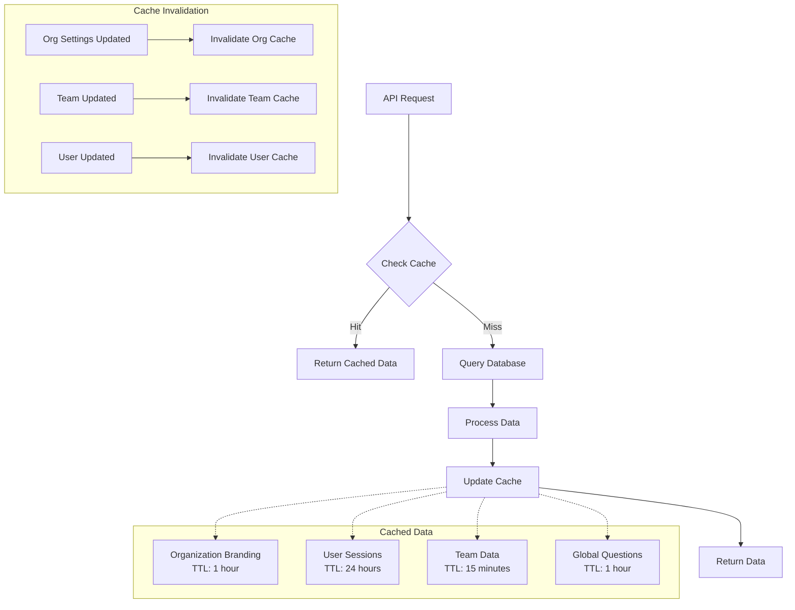

# Architecture Diagrams

## System Architecture Overview

## Multi-Tenant Data Isolation

## Role Hierarchy & Permissions

## Database Schema (Entity Relationship)

## Authentication Flow

## Invitation Processing Flow

## Team Join Request Flow

## Caching Strategy

