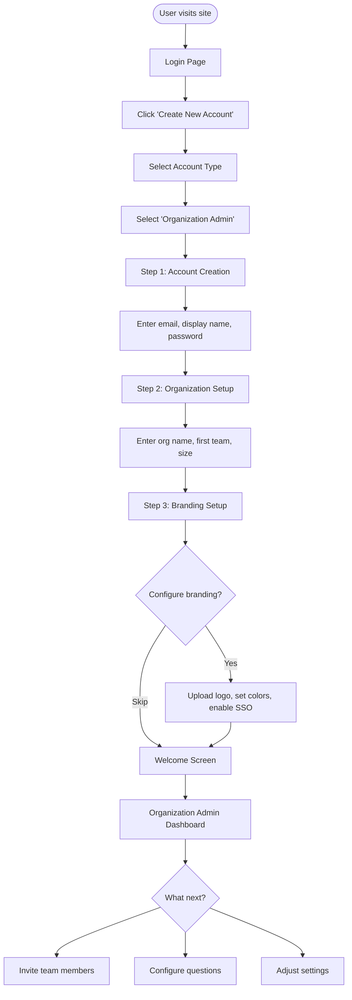
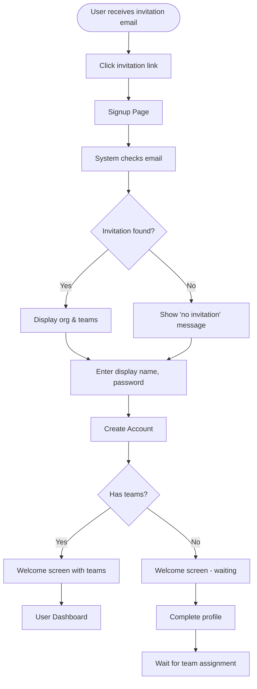
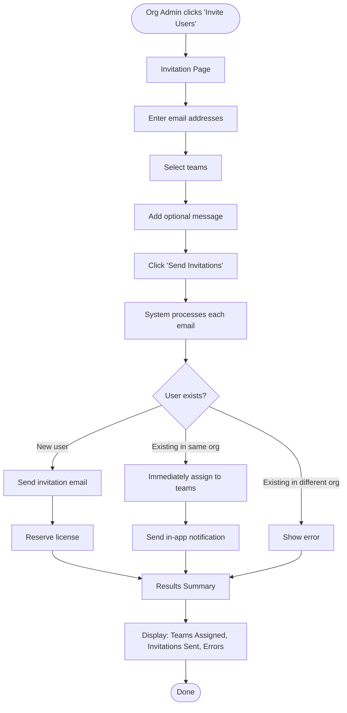
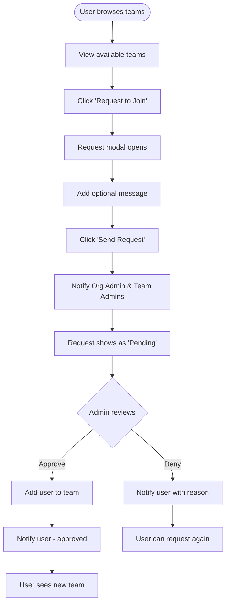
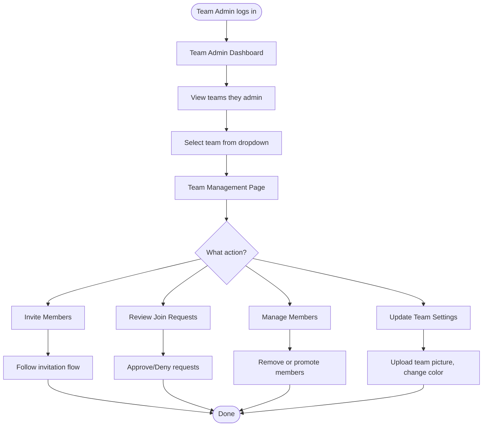
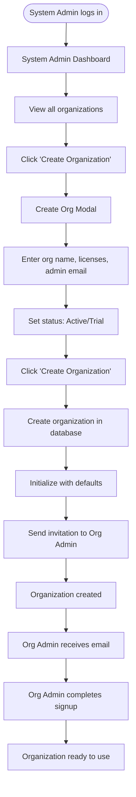
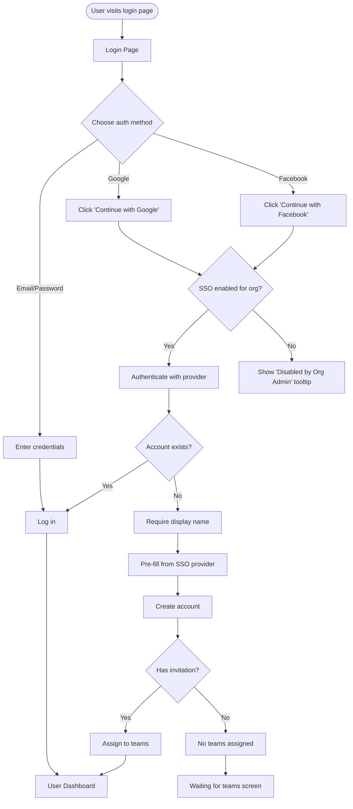
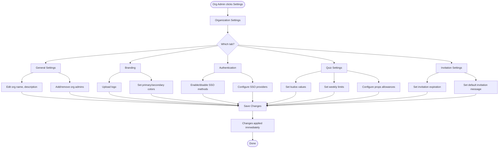

# User Flow Diagrams

## Overview
Mermaid diagrams showing key user flows for the multi-tenant organization system.

## Flow 1: New Organization Admin Signup

## Flow 2: Standard User Signup (With Invitation)

## Flow 3: Organization Admin Invites Users

## Flow 4: User Requests to Join Team

## Flow 5: Team Admin Manages Team

## Flow 6: System Admin Creates Organization

## Flow 7: User Login with SSO

## Flow 8: Organization Admin Configures Settings

